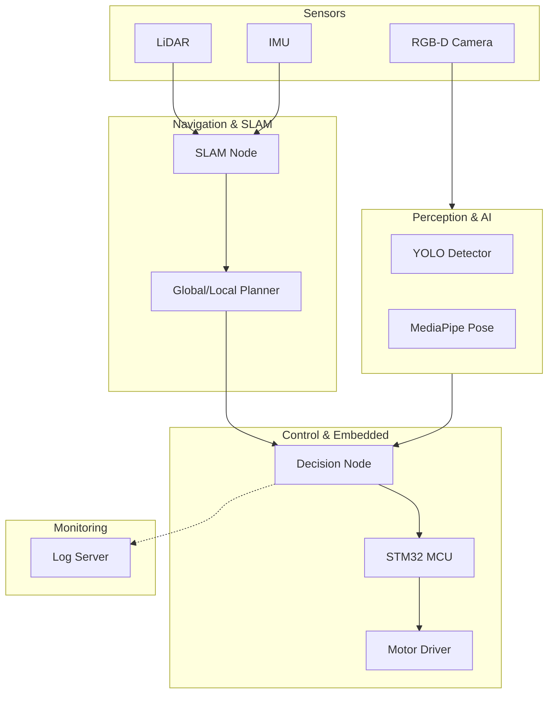

# 🤖 Robot Software & Embedded Portfolio - 남상기

<div align="center">


> **"Sensor-based Perception–Decision–Control Pipeline Developer"**

</div>

<br>

## 📌 Introduction
안녕하세요, 로봇 소프트웨어 및 임베디드 개발자 **남상기**입니다.  
이 저장소는 저의 프로젝트 경험과 기술 역량을 담은 **웹 프레젠테이션 포트폴리오**입니다.

이 프로젝트는 별도의 파워포인트 소프트웨어 없이 **웹 브라우저에서 바로 실행 가능한 HTML 기반 슬라이드**로 구성되어 있습니다.

* **Focus**: ROS2, Embedded Control (STM32), Edge AI (YOLO, MediaPipe)
* **Highlight**: 실제 하드웨어 기반의 센싱-판단-제어 파이프라인 구축 경험

<br>

## 🧩 Architecture Overview
제가 설계하는 로봇 시스템의 일반적인 데이터 흐름도(Data Flow)입니다.




## 🚀 Projects Highlights

### 1️⃣ COOLRO – Autonomous Following Golf Caddy Robot
> **Role:** Main Developer (Embedded & Vision) | **Tech:** MediaPipe, STM32, UART, Flutter

- **Vision AI:** MediaPipe를 활용한 골프 스윙 포즈 분석 및 사용자 거리 추정 알고리즘 구현
- **Embedded Control:** Raspberry Pi와 STM32 간 UART 통신 프로토콜 설계 및 실시간 모터 제어
- **Troubleshooting:** 전력 불안정으로 인한 모터 드라이버 오작동 문제를 PWM 튜닝 및 하드웨어 전원 분리로 해결
- **UX:** Flutter 기반의 실시간 영상 스트리밍 및 제어 앱 개발

### 2️⃣ ROS2 Autonomous Navigation Robot
> **Role:** Robot SW Engineer | **Tech:** ROS2 Humble, Nav2, SLAM, C++

- **Navigation:** LiDAR + IMU 센서 퓨전 기반의 SLAM 맵핑 및 Nav2 자율주행 구현
- **Planner Tuning:** 실내 주행 시 동적 장애물 회피를 위한 DWA Local Planner 파라미터 최적화
- **System Design:** 일관된 좌표 변환(Coordinate Transform)을 위한 TF Tree 및 Sensor Frame 설계

### 3️⃣ IoT + Edge Vision System
> **Role:** System Engineer | **Tech:** Python, TCP/IP, YOLO, Edge Device

- **Edge Computing:** 엣지 디바이스에서 YOLO/MediaPipe 추론을 수행하여 서버 대역폭 및 지연시간(Latency) 감소
- **Communication:** JSON 기반 커스텀 프로토콜 설계 및 TCP/Serial 센서 데이터 스트리밍 구현

### 4️⃣ Robot Service Planning (AIROVER)
> **Role:** Planner (PM) | **Tech:** Requirement Analysis, Scenario Design

- 실내 서비스 로봇의 요구사항 정의(PRD) 및 하드웨어/센서 사양(Spec) 선정
- 서비스 시나리오에 따른 State Diagram 설계 및 데이터 흐름 문서화

<br>

## 🛠 Tech Stack

| Category           | Technology                                   |
|--------------------|----------------------------------------------|
| Languages          | C++, Python, C                               |
| Frameworks / Libs  | ROS2 (Nav2, TF), OpenCV, Flutter             |
| Embedded           | STM32 (HAL), UART, PWM, GPIO                 |
| AI / Vision        | YOLO, MediaPipe                              |
| Hardware           | LiDAR, IMU, RGB-D Camera, Raspberry Pi       |

---

## 💻 How to Run (Portfolio Presentation)

이 포트폴리오는 **HTML 슬라이드 형태**로 제공됩니다.

1. **저장소 클론**

```bash
git clone https://github.com/username/portfolio.git
```
## 📬 Contact

- **Email**: email@address.com  
- **GitHub**: https://github.com/username

