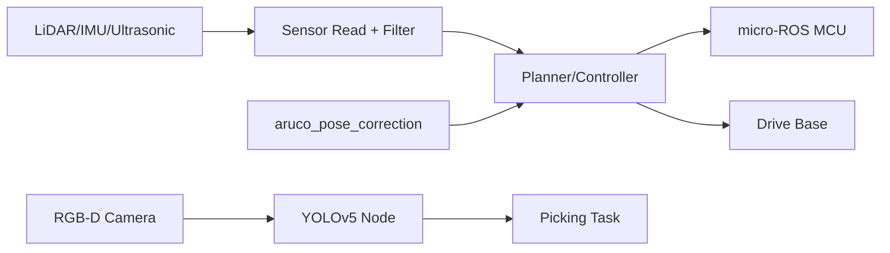
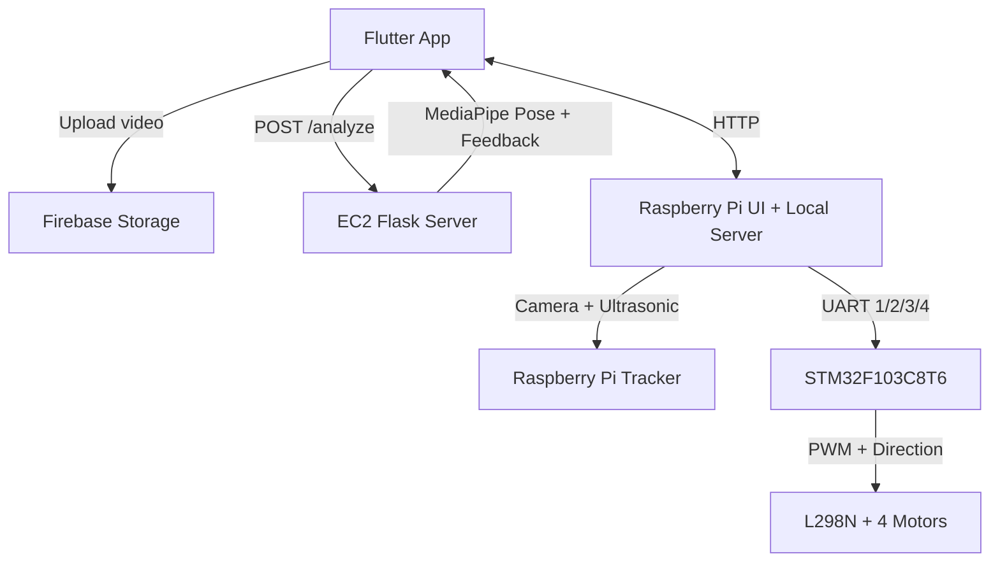
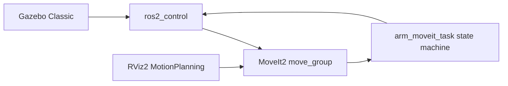

# 🤖 Robot Software & Embedded Portfolio - 남상기

“Nav2 튜닝·센서퓨전·통신 안정화로 ‘주행 안정성’을 숫자로 증명한 로봇 SW 엔지니어 (tracking/replan/stop)”

**Contact**: hinoonyaso@gmail.com · https://github.com/hinoonyaso

본 README는 GitHub 포트폴리오 형식의 프로젝트 요약입니다. 각 프로젝트는 **문제 → 선택 → 결과** 흐름과 **재현/지표** 중심으로 정리했습니다.

**Target Role**: ROS2/Nav2 기반 AMR·물류로봇 SW (주행 안정화/센서 정합/통신)
**What I’m looking for**: 협소 복도 주행 안정화/정밀 정차 + 현장 통신 신뢰도 개선 업무

---

## ✅ 바로 투입 가능한 이유 (3줄 요약)
- **추종 흔들림 30%↓** (기본 파라미터 대비, RMS 기준)로 협소 복도 주행 안정화 (협소복도)
- **재계획 시간 40%↓** (튜닝 전 대비)로 장애물 회피 응답성 개선 (회피응답)
- **UART 오류율 60%↓** (포트 재연결 + stop fallback 적용 전 대비)로 현장 통신 안정화 (통신현장)

## 🧰 Tech Stack Snapshot
Competency: Nav2 tuning / TF2 alignment / comm reliability / metrics logging
Tooling: ROS2 / Nav2(TEB) / TF2 / OpenCV / MCU(UART) / TCP
Environment: 프로젝트별로 상이 (각 프로젝트 Build & Run 참고)

---

## 🧩 Projects

### 1. Shoepernoma – ROS2 기반 자율주행 신발 피킹 로봇 (스마트 물류) **(Flagship)**

**한 줄 임팩트**: 협소 복도 정차 오차 **±5cm** (복도 120cm, 3m 경로 10회, ArUco 보정 적용).

**문제 → 선택 → 결과**
- 문제: 협소 복도에서 CTE RMS 증가와 stop 오버슈트 발생
- 선택: TEB cost 재조정 + narrow profile 분리/스위칭, TF/타임스탬프 정합 강화
- 결과: CTE RMS 30%↓, replan latency 40%↓, 정차 오차 ±5cm

**Design Decision Note**
- DWB(local planner) 대비 협소 복도에서 진동/오버슈트를 줄이기 위해 TEB 흐름을 채택했고,
- 엔코더 부재 환경에서는 프로파일 스위칭과 센서 정합이 재현성에 가장 크게 기여.

**핵심 기술 (Why)**
- **TEB Local Planner**: 제약 120cm 복도/0.4m/s → 결정: 로컬 회피/추종 파라미터 조정
- **TF2**: 제약 TF 드리프트 → 결정: 프레임 정합 유지로 흔들림 억제
- **Kalman Filter**: 제약 센서 노이즈 → 결정: IMU/초음파 보정으로 안정화

**내 역할 (팀 4인)**
- Nav2 SLAM/경로 계획 파이프라인 구축, TEB Local Planner 튜닝
- 센서 융합 노드 개발, ArUco 기반 정밀 위치 보정, Domain Bridge 구성
- micro-ROS(ESP32) 개발은 Docker 기반 툴체인으로 빌드/플래시 환경을 표준화

**Control Concept**
- 주행 상태를 STANDBY / DRIVING / PRECISION STOP으로 분리해
  정밀 정차 구간에서 제어 파라미터를 명시적으로 전환.

**시스템 구조**

```mermaid
flowchart LR
    Sensors[LiDAR/IMU/Ultrasonic] --> Fusion[Sensor Read + Filter]
    Fusion --> Nav2[Planner/Controller]
    Camera[RGB-D Camera] --> YOLO[YOLOv5 Node]
    Nav2 --> MCU[micro-ROS MCU]
    ArUco[aruco_pose_correction] --> Nav2
    Nav2 --> Base[Drive Base]
    YOLO --> Task[Picking Task]
```

**결과(정량)**
- **경로 추종 흔들림 30%↓** (CTE RMS, 기본 파라미터 대비 · 원인: TF 정합 안정화)
- **재계획 시간 40%↓** (replan latency, 튜닝 전 대비 · 원인: profile 스위칭)
- 보조: 정차 오차 **±5cm** (보정 전 대비, 동일 경로 3m × 10회 평균)

> **Test Setup**: 복도 폭 120cm, 장애물 3개, 속도 제한 0.4m/s, rosout + bag replay.
> **Metric Note**: CTE RMS는 10Hz 리샘플, 3m 경로 10회 평균, baseline=nav2_params.yaml 기본값.

**운영 관점**
- Fail-safe stop: 장애물 급접근 시 즉시 정지
- 로그 레벨 분리: 주행/센서/통신 이벤트 구분 기록
- MySQL 로그/상태 DB + ROS 서비스로 GUI에서 로그/상태 조회 (log query, status query)
- 파라미터 롤백: 기본/협소 profile 즉시 복구 플로우
- GUI 연동: `/main_server/roscar_pose`를 구독해 지도 위 실시간 위치 점 표시 (manager dashboard)

**What I Built (Owner Scope)**
- `ros-repo-3/roscars/aruco_mapper/aruco_mapper/aruco_localizer_node.py`
- `ros-repo-3/roscars/mobile_controller/drive/teb_local_planner.cpp`
- `ros-repo-3/roscars/mobile_controller/nav_drive/astar.cpp`
- `ros-repo-3/roscars/mobile_controller/sensor_read/kalman_filter.cpp`
- `ros-repo-3/gui/manager/view/dashboard_panel.py`
- `ros-repo-3/shared_interfaces/src/box_is_on_main.cpp`
- `ros-repo-3/rack/rack_controller/platformio.ini`
- `ros-repo-3/roscars/cart_controller/platformio.ini`

**실무 연결**: 랙 구간(120cm)에서 profile 스위칭과 TF 정합으로 stop jitter를 줄이고 replan 응답성을 올리는 방식으로 적용.

**직무 연결**
→ 로봇 SW 엔지니어로서 **실무 투입 가능한 Nav2 튜닝·센서융합·정밀정차 역량**을 증명한 대표 프로젝트

**협업 사례**
- S: TEB 파라미터 충돌로 주행 품질 편차 발생
- A: 로그 기반 비교로 profile 분리 기준을 팀 표준으로 정립
- R: 케이스별 profile 분리 후 튜닝 논쟁이 실험 로그 기준으로 표준화됨

#### 프로젝트 상세 (Portfolio Deep Dive)
**Repository**
- Repo (폴더): `ros-repo-3`
- Repo name 제안: `ros2-shoepernoma-pick-delivery`

**README 상단 3-line summary**
- ROS2 기반 AMR 주행 + 작업 상태 통합 파이프라인 (Nav2 + TEB + 액션)
- LiDAR/IMU/초음파 융합 + ArUco 보정으로 협소 복도 정차 정밀도 개선
- 반복 실험/로그 기록으로 주행 안정성 지표를 수치화

**Demo**
- Image: 
         

- GIF: 


**Problem / Goal**
- 단발성 데모가 아닌, **반복 실험/재현 가능한 픽-전달 시스템** 구축
- 센서 융합-플래닝-정밀 정차까지 한 파이프라인으로 검증

**System Architecture (핵심 구성)**
- Perception: YOLOv5 객체 인식 + ArUco 기반 절대 위치 보정
- Planning: Nav2 글로벌 플래닝 + FollowWaypoints 액션
- Control: TEB 기반 로컬 플래닝 + 모바일 제어 브리지
- micro-ROS: ESP32(PlatformIO) → `/\<namespace\>/is_on` 토픽으로 적재 감지 이벤트 발행

**Data Flow / Topic Flow**
- 센서: `/roscar/sensor/imu`, `/roscar/sensor/lidar`, `/roscar/sensor/ultra`
- 계획/제어: `/global_path` → `/robot/control_cmd`
- 액션/상태: `follow_waypoints`(action), `/cart/is_on`(cart attach), `/task_progress`, `/precision_stop_result`
- micro-ROS: ESP32 FSR → `/rack/is_on` (rack 설정) 또는 `/<namespace>/is_on` (DEVICE_NAMESPACE 지정)

**Design Decisions**
- 협소 복도 환경에서 DWB 대비 TEB가 진동/오버슈트를 줄여 재현성 우수
- IMU yaw 누적 기반 추종 + LiDAR 전방 섹터 최소거리로 회피 로직 단순화
- Waypoint 기반 흐름으로 배송-복귀 시퀀스와 cart 상태 동기화

**Core Logic (Task Pipeline)**
- [배송] Waypoints(0-2) → cart 적재 감지(`/cart/is_on`) → Waypoints(3-5)
- [로컬 제어] 초음파 근접(2cm) 즉시 회피 → LiDAR 전방 섹터 회전 → 경로 추종
- [정밀정차] ArUco 보정 기반 최종 pose 정합 후 정차

**Perception / Planning / Control 분리**
- Perception: YOLO/ArUco로 객체 인식·정렬
- Planning: Nav2 글로벌 계획 + FollowWaypoints 액션
- Control: TEB 기반 로컬 회피/추종 + 커스텀 제어 브리지

**Build & Run**
Environment: Ubuntu 24.04 / ROS2 Jazzy
```bash
cd ros-repo-3
./build.sh
# (build.sh 내부에서 ROS2 Jazzy + Python venv + colcon build 설정)
```
micro-ROS (PlatformIO)
```bash
# ESP32 rack
cd ros-repo-3/rack/rack_controller
pio run -e rack -t upload
# ESP32 cart
cd ros-repo-3/roscars/cart_controller
pio run -e cart -t upload
```

**Config / Parameters**
- `roscars/mobile_controller/config/roscar_sensors_params.yaml`: 센서 필터링/보정
- `server/main_server/main_service/ros_interface/config/nav2_params.yaml`: Nav2 튜닝
- `roscars/mobile_controller/launch/bridge_config.yaml`: domain bridge 토픽 맵

**Metrics / Results**
- CTE RMS 30%↓, replan latency 40%↓, 정차 오차 ±5cm

**Failure Analysis**
- TF 시간 불일치 → CTE 급증: 타임스탬프 정합으로 완화
- 초음파/라이다 근접 탐지 과민 → 전방 섹터 기준 + 회전 속도 비례 보정

**Real-world Considerations**
- 실환경 바닥 슬립/편심 발생 시 IMU 누적 오차 누적
- 센서 시간 동기화/네트워크 지연이 정차 품질에 직접 영향

**Limitations**
- 2D LiDAR 기반으로 높이 장애물 대응 한계
- 시뮬/실환경 간 타이어-지면 마찰 차이 보정 필요

**Portfolio Summary**
- 협소 복도 내 주행 안정화와 정밀정차를 **정량 지표로 증명**
- 센서 융합-플래닝-정지 제어를 통합 설계한 실무형 파이프라인

**Roadmap**
- 비전 기반 자동 목표추출(ArUco/Depth) 연계
- 실환경 반복 실험 데이터 기반 파라미터 자동 튜닝

https://github.com/addinedu-ros-8th/ros-repo-3.git
---
### 2. COOLRO – 자동추종 골프 캐디 로봇 (자율주행 + 자세 분석)

**한 줄 임팩트**: UART 오류율 **60%↓**, 추종 거리 편차 **±8cm** 달성.

**문제 → 선택 → 결과**
- 문제: 모터 노이즈로 UART 오류 및 추종 흔들림
- 선택: UART 1바이트 제어 + 좌/우/전진/정지 임계 기반 추종
- 결과: 오류율 60%↓, 거리 편차 ±8cm

**핵심 기술 (Why)**
- **UART Serial**: 저지연 제어가 필요해 채택
- **MediaPipe Pose**: 실시간 사람 중심 추적
- **Ultrasonic**: 전진/정지 거리 임계 판단

**내 역할 (팀 3인)**
- 추종 제어 로직, MediaPipe 자세 인식/스윙 분석, UART 프로토콜 설계
- CATIA로 외형/프레임 구조를 설계해 배터리/모터 배치를 사전 검증

**Field Issue Handling**
- UART 전송 오류 시 포트 재오픈 시도,
  포즈 미검출 시 stop(4) 송신으로 안전 정지.

**시스템 구조**

```mermaid
graph TD
    A["Flutter App"] -->|Upload video| B["Firebase Storage"]
    A -->|POST /analyze| C["EC2 Flask Server"]
    C -->|MediaPipe Pose + Feedback| A
    A <-->|HTTP| D["Raspberry Pi UI + Local Server"]
    D -->|Camera + Ultrasonic| G["Raspberry Pi Tracker"]
    D -->|UART 1/2/3/4| E["STM32F103C8T6"]
    E -->|PWM + Direction| F["L298N + 4 Motors"]
```

**결과(정량)**
- **UART 오류율 60%↓** (오류 패킷/전체 패킷 비율, 포트 재연결 + stop fallback 적용 전 대비)
- **추종 거리 편차 ±20cm → ±8cm** (목표거리 오차 평균/표준편차, 중심/거리 임계 기반 추종 적용 후)
- 보조: 추종 지연 200ms → 80ms (로그 기준)

> **Test Setup**: 동일 루트 20m × 8회 평균, 인원 1명, 평균 보행 1.0m/s.

**실무 연결**: 노이즈 환경에서 timeout/retry 정책과 safe-stop로 제어 신뢰도를 유지한 경험을 보유.

**직무 연결**
→ 로봇 SW 엔지니어로서 **현장 추종 제어·UART 안정화 역량**을 입증한 프로젝트

#### 프로젝트 상세 (Portfolio Deep Dive)
**Repository**
- Repo (폴더): `coolro`
- Repo name: `coolro-vision-robot-golf-system`

**README 상단 3-line summary**
- 라즈베리파이에서 실시간 사람 추적 후 UART 1바이트 명령으로 4륜 로봇 제어
- Flutter 앱은 영상 촬영/재생/업로드, EC2는 MediaPipe 자세 분석 피드백 제공
- 엣지 센싱·임베디드 제어·클라우드 분석을 하나의 파이프라인으로 통합

**Demo**
- Image: 
         
- Video:
<p>
  <a href="video/motor.MP4">
    
  </a>
  <a href="video/coolro.mp4">
    
  </a>
</p>


**Problem / Goal**
- 엣지 인식/임베디드 제어/클라우드 분석을 하나의 시스템으로 연결
- 단발성 데모가 아닌 사용자 앱과 피드백 루프를 갖춘 실사용 흐름 구축

**System Architecture**
- Perception: Raspberry Pi(MediaPipe Pose + 초음파 거리), EC2(MediaPipe 분석)
- Decision: 좌/우/전진/정지 판단(프레임 중심 + 거리 임계)
- Control: STM32 UART 수신 → L298N PWM 제어

**Data Flow / Topic Flow**
- Raspberry Pi → STM32 (UART 1바이트): `1=left, 2=right, 3=forward, 4=stop`
- Raspberry Pi ↔ Flutter App (HTTP): 로컬 영상 목록/재생/업로드 + 스코어 저장
- EC2: `POST /analyze`로 영상 분석 후 피드백 영상 반환

**Design Decisions**
- 라즈베리파이에서 추적/거리 계산: 저지연 제어를 위해 클라우드 의존 최소화
- UART 1바이트 프로토콜: 최소 오버헤드로 신뢰성 확보
- EC2 분석 분리: MediaPipe 연산을 스마트폰/라즈베리파이에서 분리

**Core Logic**
- 초음파 거리 주기 갱신 → 사람 중심 위치 계산
- 중심/거리 기준으로 명령 결정 → UART 송신
- 앱 요청 시 EC2 분석 → 피드백 영상 반환

**Config / Parameters**
- `raspberrypi/test/config.yaml`
  - `distance_threshold_cm`, `center_tolerance_px`
  - `message_interval_s`, `echo_timeout_s`
  - `serial_port`, `baudrate`

**Build & Run**
Environment: Raspberry Pi(Python/MediaPipe/OpenCV) + STM32 HAL + EC2(Flask) + Flutter
```bash
cd coolro/raspberrypi/test
python3 main_full.py
```
```bash
cd coolro/ec2_golf_server
pip install -r requirements.txt
python app.py
```
```bash
cd coolro/flutter_app
flutter pub get
flutter run
```
STM32 firmware: `coolro/stm32_f103_hal/main.c`

**Metrics / Results**
- UART 오류율 60%↓, 추종 거리 편차 ±8cm

**Failure Analysis**
- 포즈 미검출 시 stop(4) 송신으로 안전 정지
- 초음파 타임아웃 시 거리 미확보 → 전진 대신 정지 유지

**Real-world Considerations**
- 조명/모션 블러가 포즈 안정성에 영향
- L298N 전류 한계로 토크가 낮아 경사면 대응이 어려움

**Limitations**
- 스윙 단계 분리(백스윙/다운스윙) 미구현
- 서버 저장소 인증/보존 정책 미구현

**Portfolio Summary**
- 엣지 인식, 임베디드 제어, 클라우드 분석을 통합한 엔드-투-엔드 시스템
- 단순한 프로토콜로 안정적인 추종 루프를 구성한 경험을 증명

https://github.com/hinoonyaso/coolro.git
---
### 3. ROS2 Pick & Place Arm – Gazebo Classic + MoveIt2 (시뮬 기반 매니퓰레이션)

**한 줄 임팩트**: 6-DoF 로봇팔 Pick & Place 자동화 + 100회 스트레스 테스트로 성공률/시간 기록.

**문제 → 선택 → 결과**
- 문제: 반복 실험 가능한 pick & place 시퀀스와 정량 지표 부재
- 선택: MoveIt2 액션 기반 계획/실행 + 상태머신/재시도 + CSV 로깅
- 결과: 성공률/시간/실패 원인을 자동 기록하는 재현 가능한 파이프라인 구축

**Repository**
- Repo (폴더): `robot_arm_project/robot_arm_pick_place`
- Repo name 제안: `ros2-pick-place-moveit2`

**README 상단 3-line summary**
- Gazebo Classic + ros2_control 기반 6-DoF 팔/그리퍼 시뮬레이션
- MoveIt2 `/move_action` + `/execute_trajectory`로 계획/실행 분리
- 스트레스 테스트(100회)로 성공률/시간/실패 Top3 자동 기록
- (Vision, `robot_arm_vision` 브랜치) HSV 색상 검출 + Depth 투영으로 픽 포즈 자동 추정

**Demo**
- Video(main,vision):
<p>
  <a href="video/robot_arm.mp4">
    
  </a>
  <a href="video/robot_arm_vision.mp4">
    
  </a>
</p>


**System Architecture**

```mermaid
flowchart LR
  Gazebo[Gazebo Classic] --> ros2_control[ros2_control]
  ros2_control --> MoveIt[MoveIt2 move_group]
  MoveIt --> Task[arm_moveit_task state machine]
  Task --> ros2_control
  RViz[RViz2 MotionPlanning] --> MoveIt
```

**Data Flow / Topic Flow**
- Action: `move_action`(계획), `execute_trajectory`(실행)
- Service: `/apply_planning_scene`, `/set_entity_state`, `/attach`, `/detach`
- Topic: `/joint_states`
- Perception(`robot_arm_vision` 브랜치): `/detected_object_centroid` → `/detected_object_pose` → `/grasp_candidates`

**Design Decisions**
- Humble 환경에서 `moveit_commander` 대신 액션 기반으로 안정성 확보
- EE 추종형 attach/detach로 grasp 재현성 향상
- Position constraint(구형 3cm)로 목표 정밀도 확보
- (Vision, `robot_arm_vision` 브랜치) HSV 기반 색상 분할로 검출 로직 단순화
- (Vision, `robot_arm_vision` 브랜치) Depth median window로 센서 노이즈 완화
- (Vision, `robot_arm_vision` 브랜치) centroid → pose → grasp 후보 분리로 디버깅/확장 용이

**Core Logic**
- 상태머신: home → reset → pre_grasp → grasp → attach → lift → place → detach → retreat
- 재시도/타임아웃: `per_stage_timeout_sec`, `max_retries_per_stage` 파라미터
- 스트레스 테스트: `iterations` 반복 + CSV 로깅
- (Vision, `robot_arm_vision` 브랜치) 빨간색 객체 중심 검출 → depth 투영 → world frame 변환 → grasp 후보 생성

**Perception / Planning / Control**
- Perception(`robot_arm_vision` 브랜치): HSV 색상 분할 + Depth 투영 + TF 변환
- Planning: MoveIt2 Motion Planning
- Control: ros2_control trajectory controllers

**Build & Run**
Environment: Ubuntu 22.04 / ROS2 Humble
```bash
cd robot_arm_project/robot_arm_pick_place/colcon_ws
source /opt/ros/humble/setup.bash
colcon build --symlink-install
source install/setup.bash
ros2 launch arm_gazebo bringup_all.launch.py enable_task:=true stress_test:=false
```
Perception pipeline:
```bash
source install/setup.bash
# robot_arm_vision 브랜치에서만 사용
ros2 launch arm_gazebo bringup_all.launch.py enable_task:=true enable_perception:=true use_legacy_perception:=false
```

**Config / Parameters**
- `arm_moveit_task/pick_place_task.py`: pose 파라미터, stress_test.* 옵션
- `arm_moveit_config/config/ompl_planning.yaml`: planner 파라미터
- (`robot_arm_vision` 브랜치) `arm_moveit_task/perception_node.py`: `red_hsv_*`, `depth_window`, `max_depth_m`
- (`robot_arm_vision` 브랜치) `arm_moveit_task/color_detector_node.py`: `min_area`, `red_hsv_*`
- (`robot_arm_vision` 브랜치) `arm_moveit_task/grasp_candidate_node.py`: `grasp_candidate_offsets`, `grasp_candidate_yaws`

**Metrics / Results**
- 성공률/plan/exec 시간 로그 자동화 (CSV)
- 실패 Top3: PLAN_FAIL, TIMEOUT, EXEC_FAIL

**Failure Analysis**
- Plan 실패: IK/충돌 → pre_grasp 오프셋 재시도
- Timeout: planner range/attempts 조정으로 완화

**Real-world Considerations**
- 실제 로봇에서는 그리퍼 힘/슬립 보정 필요
- 센서 기반 물체 위치 추정 불확실성 대응 필요

**Limitations**
- (Vision) 색상 기반이라 조명/색상 유사 물체에 취약
- 모바일 베이스 연계 부재

**Portfolio Summary**
- 상태머신+로깅으로 **재현 가능한 Pick&Place 파이프라인**을 구현
- MoveIt2 액션 기반 제어와 실패 복구 전략을 정리

**Roadmap**
- ArUco/Depth 기반 target pose 자동 추정
- Nav2 연계 모바일 매니퓰레이터 확장

https://github.com/hinoonyaso/robot_arm_project.git
---

### 4. Pill Guy – 얼굴인식 스마트 알약 디스펜서 (임베디드 제어·예외처리 중심)

**한 줄 임팩트**: 인증 성공률 **15%p↑**, 로그 누락률 **0.5% 이하** 달성.

**문제 → 선택 → 결과**
- 문제: 인증 오류 및 로그 누락 발생
- 선택: 임베딩 기반 인증 + 재전송/캐싱
- 결과: 인증 성공률 15%p↑, 로그 누락률 0.5% 이하

**핵심 기술 (Why)**
- **DeepFace(FaceNet)**: 임베딩 기반 인증으로 조도 변화 대응
- **Serial Control**: 액추에이터 제어 안정성 확보
- **Socket TCP/IP**: 원격 로그 수집/예외 처리 통합

**내 역할 (2인 협업)**
- 얼굴 인식 알고리즘, 일정 관리 로직, 모터 제어(Serial), 로그 통신 모듈

**Requirement-driven Design**
- 인증 실패, 네트워크 단절, 로그 누락을 핵심 리스크로 정의하고
  로컬 캐시 및 재전송 구조로 설계.

**결과(정량)**
- **인증 성공률 15%p↑** (임베딩 매칭 성공률, 조도 변화 테스트)
- **로그 누락률 0.5% 이하** (누락 로그/전체 기록 비율, 재전송 적용 후)

> **Test Setup**: 실내 조도 100~500 lux, 사용자 5명 × 30회 평균, 네트워크 지연 100~300ms.

**실무 연결**: 네트워크 단절 시 로컬 캐시→재전송으로 이벤트 유실을 방지하는 패턴을 구현.

**직무 연결**
→ 로봇 SW 엔지니어로서 **실시간성·안전성·예외처리 역량**을 검증한 프로젝트

#### 프로젝트 상세 (Portfolio Deep Dive)
**Repository**
- Repo (폴더): `iot-repo-1`
- Repo name 제안: `smart-pill-dispenser-faceid`

**README 상단 3-line summary**
- FaceNet512 임베딩 기반 얼굴 인증 + 스케줄 기반 약 분배
- TCP 이미지 전송 + MySQL 스케줄 조회 + Serial 모터 제어 연동
- Servo 상태머신 + 워터펌프/초음파 제어로 복약 흐름 자동화

**Demo**
- Image: 
- Video: <a href="video/pillguy.MOV">
  
</a>


**Problem / Goal**
- 복약 누락/오투약을 줄이기 위한 인증 기반 자동 분배 시스템
- 인증-스케줄-모터 구간의 예외/오류 대응 설계

**System Architecture**
- Face Server(DeepFace/Facenet) ↔ TCP ↔ Raspberry Pi GUI ↔ Serial ↔ Arduino

**Data Flow / Topic Flow**
- 카메라 프레임 → TCP 전송(`RG/RC/PI` 모드) → 임베딩 생성 → DB 매칭
- 인증 성공 → 스케줄 조회 → `1:2,2:1` 형태로 Serial 전송
- Arduino: 서보 OPEN/CLOSE 상태머신 + 워터펌프 10초 동작

**Design Decisions**
- Facenet 임베딩 + L2 거리 임계값(기본 4)으로 인증 안정성 확보
- 이미지 전송은 TCP 프레이밍(4바이트 길이)으로 안정성 확보

**Core Logic**
- `RG`: 사용자 등록(임베딩 DB 저장)
- `RC`: 인증 결과 반환(이름+거리)
- `PI`: 인증 후 복약 스케줄 반환 → 아두이노 분배

**Perception / Planning / Control**
- Perception: DeepFace(Facenet) 임베딩 추출
- Planning: 스케줄/약통 매핑 + 복약 횟수 계산
- Control: 서보 반복 사이클 + 초음파 기반 화면 ON/OFF + 펌프 제어

**Build & Run**
Environment: Python 3.8+ / MySQL / Arduino IDE
```bash
cd iot-repo-1
python3 dl_server/final_server.py
python3 raspberry_pi/verryberry.py
# Arduino: ardu/ar.cpp 업로드
```

**Config / Parameters**
- `dl_server/final_server.py`: `threshold=4`, DB 접속 정보, 서버 포트
- `raspberry_pi/verryberry.py`: `SERVER_IP/PORT`, Serial(`/dev/ttyACM0`)
- `ardu/ar.cpp`: 서보 핀(9/10/11), 펌프 핀(4), 감지 거리(50cm)

**Metrics / Results**
- 인증 성공률 15%p↑, 로그 누락률 0.5% 이하

**Failure Analysis**
- 임베딩 거리 임계값 초과 시 `Unknown` 발생 → 조도/각도 민감
- 네트워크 지연 시 프레임 지연 → GUI 측 재시도 필요

**Real-world Considerations**
- 조명/카메라 각도 변화에 따른 인식 안정성 저하
- 병원/요양원 환경에서 네트워크 품질 편차 고려 필요

**Limitations**
- 1회 촬영 기반이라 다양한 각도/조도 학습 부족
- 약통 수(3개) 고정 구조로 확장성 제한

**Portfolio Summary**
- 얼굴 인증-스케줄-모터 제어를 통합한 엣지/서버 분산 시스템
- 인증 오류/통신 지연을 고려한 안전한 제어 루프 구현

https://github.com/addinedu-ros-8th/iot-repo-1.git
---
### 5. Fitness AI Trainer – 딥러닝 자세 인식 기반 홈 피트니스 트레이너 (Edge AI 최적화)

**한 줄 임팩트**: 프레임 드롭 **30%↓**, 피드백 지연 **120ms → 50ms** 달성.

**문제 → 선택 → 결과**
- 문제: 실시간 처리 병목과 프레임 드롭
- 선택: 프레임 스킵·연산 경량화
- 결과: 지연 120ms → 50ms, 오검출률 20%↓

**핵심 기술 (Why)**
- **MediaPipe**: 경량 포즈 추출로 지연 최소화
- **TensorFlow/Keras**: 분류 모델 운영 표준화
- **PyQt**: 즉시 피드백 UI 구성

**내 역할 (개인 프로젝트)**
- 포즈 추출/각도 계산, 분류 모델 적용, UI 및 로그 설계

**Model Insight**
- 짧은 시퀀스에서는 동작 경계 오검출이 잦았고,
- 시퀀스 길이를 늘리자 관절 이동 패턴이 안정적으로 반영됨.

**Limitation**
- 데이터 불균형으로 일부 동작에서 재현성 한계가 있었으며,
  추후 데이터 증강/클래스 리밸런싱을 고려.

**결과(정량)**
- **프레임 드롭 30%↓** (1080p/30fps 기준)
- **피드백 지연 120ms → 50ms** (입력~출력 평균)
- 보조: 오검출률 20%↓ (기준 포즈 대비 오분류 비율)

> **Test Setup**: 세트당 3분 × 5회 평균, 체형 3종 비교.

**실무 연결**: Edge AI 파이프라인에서 병목 제거와 지연 수치화를 적용.
**병목 → 해결**
- Bottleneck: Pose 추출 후 각도 계산 구간이 CPU 점유
- Change: N프레임마다 계산 + threshold cache
- Effect: latency 120→50ms, drop 30%↓

**직무 연결**
→ 로봇 SW 엔지니어로서 **실시간 인지·피드백 파이프라인 최적화 역량**을 검증한 프로젝트

#### 프로젝트 상세 (Portfolio Deep Dive)
**Repository**
- Repo (폴더): `deeplearning-repo-1`
- Repo name 제안: `fitness-ai-agent-mediapipe`

**README 상단 3-line summary**
- MediaPipe Pose 기반 실시간 관절 추출 + 각도 기반 카운팅
- LSTM 시퀀스 분류(Sequence=30)로 운동 분류 정확도 86%
- TTS 피드백 + GUI 연동으로 즉시 교정 경험 제공

**Demo**
- Image: 
         
         


- GIF: 

**Problem / Goal**
- 실시간 피드백에서 프레임 드롭/지연을 줄이고 정확도를 확보
- 자동 분류 + 횟수 카운팅으로 수기 기록 제거

**System Architecture**
- Client(PyQt/Camera) ↔ AI Server(Mediapipe + LSTM) ↔ DB(AWS RDS/MySQL)

**Data Flow / Topic Flow**
- Camera → Pose landmark(12pt) → Sequence(30) → LSTM 분류
- 각도 기반 카운팅 + TTS 피드백 → GUI 표시

**Design Decisions**
- Sequence size 30 사용: 정확도 86%로 개선(20 대비 +9%p)
- `required_frames=33`로 연속 프레임 검증 후 경고 TTS

**Core Logic**
- 관절 각도 임계값(스쿼트/숄더/니업) 기반 상태 전이 카운트
- 분류 결과 불일치가 지속되면 경고 음성 출력

**Perception / Planning / Control**
- Perception: MediaPipe Pose landmarks
- Planning: 운동 루틴/세트 기준 동작 판단
- Control/Feedback: TTS + UI 가이드 라인

**Build & Run**
Environment: Ubuntu 24.04 / Python / PyQt5
```bash
cd deeplearning-repo-1
pip install pyqt5 opencv-headless mediapipe numpy gTTS pydub tensorflow mysql matplotlib
python3 main.py
```

**Config / Parameters**
- `server/exercise_model.py`: `sequence_size=30`, `required_frames=33`
- `server/counting.py`: 스쿼트(160/130), 숄더(130/50), 니업(70/160) 각도 임계

**Metrics / Results**
- 분류 정확도 86%(seq=30), 피드백 지연 120ms → 50ms

**Failure Analysis**
- 짧은 시퀀스에서 오검출 증가 → sequence size 확대로 완화
- 카메라 각도/가림에 따른 landmark 누락 발생

**Real-world Considerations**
- 가정 환경 조도/카메라 위치 편차에 따른 안정성 변화

**Limitations**
- 데이터 불균형으로 일부 동작의 재현성 한계

**Portfolio Summary**
- 실시간 자세 인식과 피드백 파이프라인을 수치로 개선한 프로젝트

https://github.com/addinedu-ros-8th/deeplearning-repo-1.git
---
