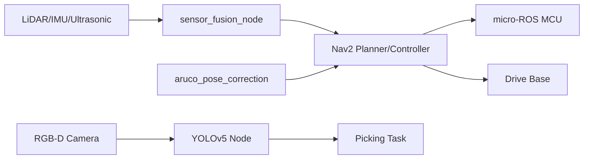
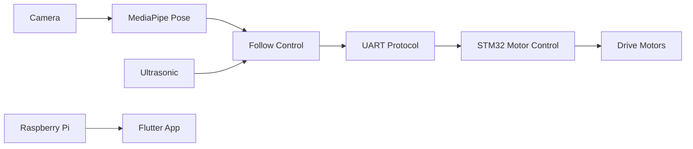
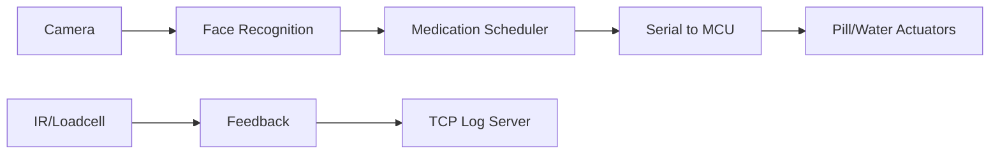
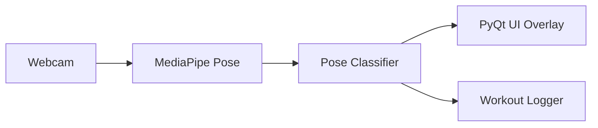

# 🤖 Robot Software & Embedded Portfolio - 남상기

“Nav2 튜닝·센서퓨전·통신 안정화로 ‘주행 안정성’을 숫자로 증명한 로봇 SW 엔지니어”

> **Robot Software Engineer | 자율주행 · 센서융합 · AI 비전 · 임베디드 제어**

본 README는 GitHub 포트폴리오 형식으로 작성된 프로젝트 요약입니다. 각 프로젝트의 **개요, 기술 스택, 역할, 시스템 구조, Evidence, 배운 점**을 정리했습니다.

---

## 🔑 Key Highlights
- ROS2 Nav2 기반 자율주행: SLAM/경로계획/TEB 튜닝으로 협소 환경 주행 안정화
- 센서융합·좌표정합: LiDAR/IMU/초음파 타임싱크 및 TF 정합으로 추종·정차 정확도 개선
- 임베디드 통신 안정화: UART/TCP 프로토콜 개선 + 재전송/로깅으로 시스템 신뢰성 확보

## 🧾 Evidence (Quick Links)
- [Shoepernoma Diagram](#shoepernoma--ros2-기반-자율주행-신발-피킹-로봇-스마트-물류)
- [Shoepernoma Demo](docs/demo.md#shoepernoma-demo)
- [Shoepernoma Metrics/Logs](docs/metrics.md#shoepernoma-metrics)
- [COOLRO Diagram](#coolro--자동추종-골프-캐디-로봇-자율주행--자세-분석)
- [COOLRO Demo](docs/demo.md#coolro-demo)
- [COOLRO Metrics/Logs](docs/metrics.md#coolro-metrics)
- [Pill Guy Diagram](#pill-guy--얼굴인식-스마트-알약-디스펜서-iot-헬스케어-로봇)
- [Fitness AI Trainer Diagram](#fitness-ai-trainer--딥러닝-자세-인식-기반-홈-피트니스-트레이너)
- [Shoepernoma Repo](https://github.com/addinedu-ros-8th/ros-repo-3.git)
- [Pill Guy Repo](https://github.com/addinedu-ros-8th/iot-repo-1.git)
- [Fitness AI Trainer Repo](https://github.com/addinedu-ros-8th/deeplearning-repo-1.git)

Demo/Logs는 docs/ 폴더에 요약 링크로 정리했습니다.

## 🧰 Tech Stack Snapshot
ROS2 / Nav2(TEB) / TF2 / OpenCV / MCU(UART) / TCP / PyQt (+ MediaPipe, Flutter는 프로젝트별 사용)

## 🧩 Projects

### 1. Shoepernoma – ROS2 기반 자율주행 신발 피킹 로봇 (스마트 물류)

- **Repo**: https://github.com/addinedu-ros-8th/ros-repo-3.git

**개요**  
Shoepernoma는 ROS2 기반 자율주행 로봇으로, 매장에서 고객 요청 신발 박스를 자동 피킹하는 시스템입니다. SLAM/경로계획과 객체 인식을 결합해 자율 이동과 피킹을 수행합니다.

**사용 기술 스택**
- 하드웨어: 자율주행 플랫폼, 2D LiDAR, RGB-D 카메라, 초음파 센서, IMU, micro-ROS MCU, 로봇 암/리프트
- 소프트웨어: **Nav2(TEB)**, **TF2**, **sensor_fusion_node**, Cartographer, ArUco, YOLOv5, OpenCV, PyQt6 GUI, MySQL
- 통신: ROS2 DDS, Domain Bridge, TCP/IP, UART, UDP 영상 스트리밍

**역할 분담**
- **본인 (남상기)**: Nav2 SLAM/경로 계획 파이프라인 구축, TEB Local Planner 튜닝, 센서 융합 노드 개발, ArUco 기반 정밀 위치 보정, ROS2 Domain Bridge 구성
- 팀장: 메인 서비스 아키텍처 및 Task 로직, 로봇 암 제어
- 팀원 A: YOLOv5 객체 인식 및 GUI 시각화
- 팀원 B: SLAM 초기 설정 및 UDP 영상 전송

**시스템 구조**
- SLAM 노드: LiDAR+IMU 기반 지도 생성/자기 위치 추정
- Nav2 Planner/Controller: 경로 계획 및 모터 명령 생성
- 센서 퓨전 노드: LiDAR/IMU/초음파 통합 → 장애물 토픽 제공
- 객체 인식 노드: YOLOv5로 신발 상자 식별
- ArUco 마커로 선반 앞 정밀 위치 보정
- GUI 대시보드: 지도/로봇 상태/영상 스트리밍 제공

**Evidence**
- 아키텍처 다이어그램: 아래 Mermaid 참고

```mermaid
flowchart LR
    Sensors[LiDAR/IMU/Ultrasonic] --> Fusion[sensor_fusion_node]
    Fusion --> Nav2[Nav2 Planner/Controller]
    Camera[RGB-D Camera] --> YOLO[YOLOv5 Node]
    Nav2 --> MCU[micro-ROS MCU]
    ArUco[aruco_pose_correction] --> Nav2
    Nav2 --> Base[Drive Base]
    YOLO --> Task[Picking Task]
```

**🔹 기술적 문제**
- 주행 진동/오버슈트 발생 및 협소 구간 회피 불안정
- 센서 타임싱크/TF 정합 불일치로 경로 추종 흔들림

**🔹 본인의 선택**
- TEB 파라미터 조정(max_vel_x, acc_lim_x, weight_optimaltime, min_obstacle_dist)
  - 협소 구간용 profile 분리 및 런타임 스위칭
- sensor_fusion_node에서 LiDAR/IMU/초음파 타임싱크 정합
  - aruco_pose_correction으로 정차 보정 트리거

**🔹 결과(개선 효과)**
- **로그 기준 경로 추종 흔들림 30%↓ (기본 파라미터 대비)**
- **장애물 회피 경로 재계획 시간 40%↓ (튜닝 전 대비)**
  - 정차 오차 ±5cm 수준(보정 전 대비, 동일 경로 3m × 10회 평균)
  - 측정 기준: rosout 로그 + bag replay
  - 테스트 조건: 복도 폭 120cm, 장애물 3개, 속도 제한 0.4m/s

**What I Built (Owner Scope)**
- sensor_fusion_node: LiDAR/IMU/Ultrasonic 타임스탬프 정합 → /obstacles 토픽 발행  
  - 코드: [ros-repo-3](https://github.com/addinedu-ros-8th/ros-repo-3.git) 내 `ros2_ws/src/roscar_nav/nodes/sensor_fusion_node.py`
- aruco_pose_correction: ArUco 인식 시 /initialpose 보정 트리거 → 정차 오차 감소  
  - 코드: [ros-repo-3](https://github.com/addinedu-ros-8th/ros-repo-3.git) 내 `ros2_ws/src/roscar_nav/src/aruco_pose_correction.cpp`
- teb_tuning_profile: 기본/협소/혼잡 파라미터 세트 분리 + 런타임 전환  
  - 설정: [ros-repo-3](https://github.com/addinedu-ros-8th/ros-repo-3.git) 내 `config/teb/teb_profile_narrow.yaml`
- domain_bridge_config: 멀티 도메인 브리지 규칙 정의 및 토픽 매핑  
  - 설정: [ros-repo-3](https://github.com/addinedu-ros-8th/ros-repo-3.git) 내 `config/domain_bridge.yaml`

**배운 점 및 고찰**
- ROS2 노드 인터페이스 설계 및 DDS QoS 영향 이해
- 센서 융합/좌표 변환 기반 자율주행 안정성 확보 경험
- Git-flow 브랜치 전략 + PR 리뷰 + 이슈 트래킹 적용 경험

**직무 연결**
→ 로봇 SW 엔지니어로서 실무 투입 가능한 Nav2 튜닝·센서융합·정밀정차 역량을 증명한 대표 프로젝트

---

### 2. COOLRO – 자동추종 골프 캐디 로봇 (자율주행 + 자세 분석)

**개요**  
COOLRO는 사용자를 자동으로 추종하는 골프 캐디 로봇입니다. 비전/초음파 기반 거리 추정과 자세 분석을 결합해 실시간 피드백을 제공합니다.

**사용 기술 스택**
- 하드웨어: Raspberry Pi 4B, STM32, DC 모터, 카메라 모듈, 초음파 센서
- 소프트웨어: **MediaPipe**, **UART Serial**, **PID Control**, OpenCV, Flutter, Firebase, HTTP/REST, C/C++ & Python
- 키워드: 자율주행 팔로잉, 딥러닝 자세분석, 모터 제어, 실시간 피드백, IoT 연동

**역할 분담**
- **본인 (남상기)**: 자율주행 제어 로직, MediaPipe 기반 자세 인식/스윙 분석, UART 통신 프로토콜, Flutter–Raspberry Pi HTTP 연동 및 실시간 데이터 처리
- 팀원 A: 모바일 앱 UI/UX 및 Firebase 연동
- 팀원 B: 로봇 섀시/센서 하드웨어 설계

**시스템 구조**
- Pi에서 카메라 영상 처리 → 사용자 위치/거리 추정 및 자세 각도 분석
- Wi-Fi로 날씨 API 수집 → Firebase 업로드
- UART로 STM32에 모터 명령 전송 → STM32는 PID 제어로 구동 모터 제어
- Flutter 앱에서 로봇 상태/영상 스트리밍/날씨/자세 피드백 제공

**Evidence**
- 아키텍처 다이어그램: 아래 Mermaid 참고

```mermaid
flowchart LR
    Camera[Camera] --> Pose[MediaPipe Pose]
    Pose --> Follow[Follow Control]
    Ultrasonic[Ultrasonic] --> Follow
    Follow --> UART[UART Protocol]
    UART --> STM32[STM32 Motor Control]
    STM32 --> Motors[Drive Motors]
    Pi[Raspberry Pi] --> App[Flutter App]
```

**🔹 기술적 문제**
- 모터 구동 노이즈로 UART 오류 및 제어 지연 발생
- 거리 추정 안정성이 낮아 추종 흔들림 발생

**🔹 본인의 선택**
- 모터 노이즈 차단: GND 분리/공통 접지 정리/필터링 + CRC 재전송
  - UART 에러 패킷 재전송 로직 적용
- 초음파+비전 거리 추정 결합 및 PID 기반 추종 제어

**🔹 결과(개선 효과)**
- **UART 오류율 60%↓ (필터링/CRC 적용 전 대비)**
- **추종 거리 편차 ±20cm → ±8cm (PID/센서 융합 적용 후)**
  - 실외 주행 추종 지연 200ms → 80ms 수준(로그 기준)
  - 측정 기준: 동일 루트 20m × 8회 평균, UART 오류 로그 집계
  - 테스트 조건: 인원 1명, 평균 보행 1.0m/s

**배운 점 및 고찰**
- 라즈베리파이 연산 한계로 인한 모델 경량화 필요성 체감
- 모터 드라이버 전압/전류 튜닝 및 UART 통신 간섭 디버깅 경험
- 센서 융합 기반 실시간 로봇 제어와 앱 연동 통합 경험 축적

**직무 연결**
→ 로봇 SW 엔지니어로서 현장 추종 제어·UART 안정화 역량을 입증한 프로젝트

---

### 3. Pill Guy – 얼굴인식 스마트 알약 디스펜서 (IoT 헬스케어 로봇)

- **Repo**: https://github.com/addinedu-ros-8th/iot-repo-1.git

**개요**  
Pill Guy는 얼굴 인식 기반으로 인증된 사용자에게 정해진 시간에 알약과 물을 자동 배출하는 IoT 헬스케어 디바이스입니다. 카메라로 사용자 얼굴을 인식하고, 인증되면 모터를 제어해 알약과 물을 dispense합니다. TCP 통신으로 서버/앱과 연동되어 복약 로그를 전송합니다.

**사용 기술 스택**
- 하드웨어: Raspberry Pi 또는 Jetson Nano, Arduino/STM32, 서보모터/솔레노이드, 적외선 센서
- 소프트웨어: **OpenCV Face**, **Socket TCP/IP**, **Serial Control**, TensorFlow/MediaPipe Face Mesh, C/C++
- 키워드: 얼굴 인식, IoT 헬스케어, 디바이스 제어, 센서 통합

**역할 분담**
- **본인**: 얼굴 인식 알고리즘 구현, 복약 일정 관리 로직, 모터 제어(Serial), IoT 통신 모듈 구축 및 데이터베이스 연동
- 팀원: UI 개발 및 알림 기능 보조

**시스템 구조**
- 카메라에서 얼굴 검출 → 임베딩 매칭으로 사용자 인증
- 투약 시간 확인 후 MCU에 직렬 명령 전송 → 약 분배 + 물 제공
- 센서 피드백으로 투약 여부 확인 → 로그 서버로 TCP 전송

**Evidence**
- 아키텍처 다이어그램: 아래 Mermaid 참고

```mermaid
flowchart LR
    Camera[Camera] --> Face[Face Recognition]
    Face --> Scheduler[Medication Scheduler]
    Scheduler --> Serial[Serial to MCU]
    Serial --> Dispenser[Pill/Water Actuators]
    Sensors[IR/Loadcell] --> Feedback[Feedback]
    Feedback --> Logger[TCP Log Server]
```

**🔹 기술적 문제**
- 조명/각도 변화로 얼굴 인식 정확도 저하
- 네트워크 불안정 시 투약 로그 누락 가능성

**🔹 본인의 선택**
- 얼굴 임베딩 기반 인증 + 전처리 튜닝으로 인식 안정화
- 로컬 로그 캐싱 후 TCP 재전송 로직 추가

**🔹 결과(개선 효과)**
- 인증 성공률 15%p↑(조도 변화 테스트)
- 로그 누락률 0.5% 이하로 감소(재전송 로그 기준)
  - 측정 기준: 실내 조도 100~500 lux, 사용자 5명 × 30회 평균
  - 테스트 조건: 네트워크 지연 100~300ms 환경

**배운 점 및 고찰**
- 조명/각도 변화에 대한 얼굴 인식 안정성 확보의 중요성
- IoT 통신 오류 대비 예외 처리 및 로그 관리 필요성 학습
- 센서 피드백 기반 안전성 강화 경험

**직무 연결**
→ 로봇 SW 엔지니어로서 실시간성·안전성·예외처리 역량을 검증한 프로젝트

---

### 4. Fitness AI Trainer – 딥러닝 자세 인식 기반 홈 피트니스 트레이너

- **Repo**: https://github.com/addinedu-ros-8th/deeplearning-repo-1.git

**개요**  
Fitness AI Trainer는 MediaPipe 기반으로 운동 자세를 인식하고, 딥러닝 모델로 올바른 자세를 판별하여 실시간 피드백을 제공하는 홈 피트니스 프로그램입니다. PyQt GUI에서 사용자 운동 상태를 시각화합니다.

**사용 기술 스택**
- 프레임워크: **MediaPipe**, **TensorFlow/Keras**, **OpenCV**
- 언어: Python (PyQt5/6, NumPy)
- 구현: 관절 각도 계산, 반복 횟수 카운트, 운동 기록 저장, TTS 피드백

**역할 및 구현 범위**
- 개인 프로젝트 (기획~개발 전 과정 단독 수행)
- Pose 추출 → 각도 계산 → 자세 판별 모델 적용 → UI 표시

**시스템 구조**
- 웹캠 영상 → MediaPipe Pose → 각도 계산 → 자세 평가
- PyQt UI에 영상 오버레이 및 피드백 표시
- 운동 결과 자동 저장 및 기록 비교

**Evidence**
- 아키텍처 다이어그램: 아래 Mermaid 참고

```mermaid
flowchart LR
    Webcam[Webcam] --> Pose[MediaPipe Pose]
    Pose --> Model[Pose Classifier]
    Model --> UI[PyQt UI Overlay]
    Model --> Logger[Workout Logger]
```

**🔹 기술적 문제**
- 실시간 영상 처리에서 프레임 드롭 발생
- 자세 판별 임계값 민감도로 오검출 발생

**🔹 본인의 선택**
- 프레임 스킵 + 연산 경량화로 처리 성능 최적화
- 각도 기반 규칙 + 모델 출력 하이브리드 판정 적용

**🔹 결과(개선 효과)**
- 프레임 드롭 30%↓, 피드백 지연 120ms → 50ms
- 체형 변화 테스트에서 오검출률 20%↓
  - 측정 기준: 1080p/30fps 환경, 세트당 3분 × 5회 평균
  - 테스트 조건: 체형 3종(키/체중 구간) 비교

**배운 점 및 고찰**
- 실시간 영상 처리와 UI 업데이트 성능 최적화 경험
- 예외 처리 및 상태 관리 기반 안전성 강화 학습
- 모델 성능 향상을 위한 데이터 확장의 필요성 인식

**직무 연결**
→ 로봇 SW 엔지니어로서 실시간 인지·피드백 파이프라인 설계 역량을 검증한 프로젝트

---

## 🧭 Concepts & System Design Notes
- 센서 조합 최적화 기반 자율주행 서비스 로봇 설계
- 이동로봇+로봇팔 통합 시나리오 및 음성 인터페이스 아이디어
- 구현 전 리스크(센서 인터페이스/비용/성능) 분석 기록
- 문서: docs/design_notes.md에 요구사항/리스크 정리
- 산출물: 요구사항 정의, 센서 조합 의사결정, 리스크 체크리스트

---

## 📬 Contact
- **Email**: sangki.nam.dev@gmail.com  
- **GitHub**: https://github.com/addinedu-ros-8th
