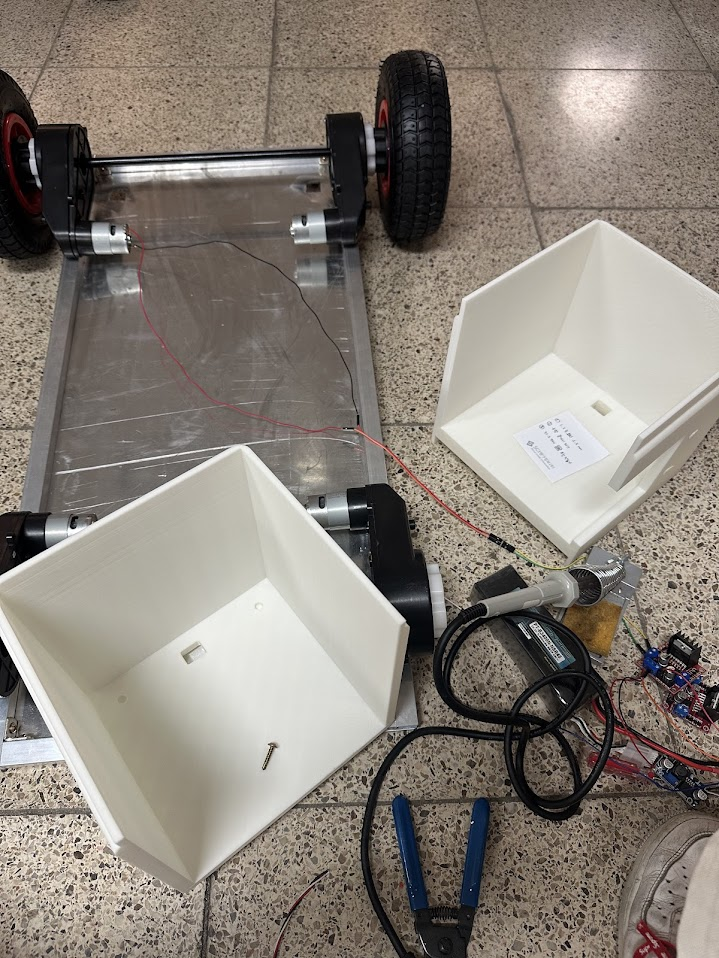
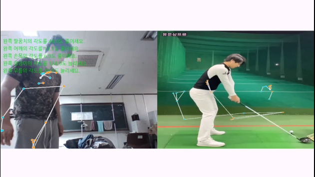
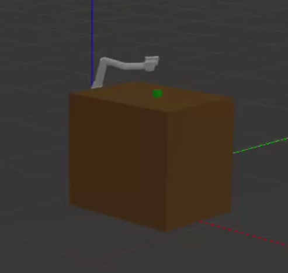
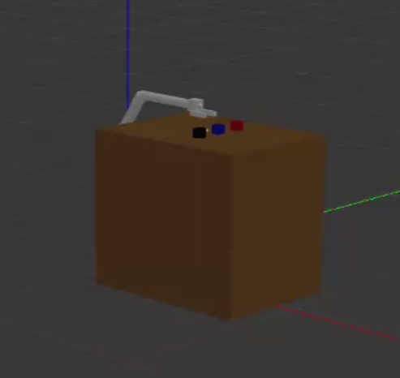
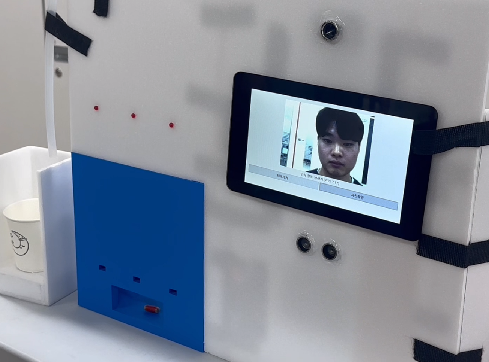

# Robotics / AI Portfolio - 남상기

로봇 SW 채용 관점에서 빠르게 검토할 수 있도록, 이 저장소는 **프로젝트 인덱스 허브** 역할에 집중합니다.

- Focus: ROS2 / Nav2 기반 AMR 주행 안정화, 센서 정합, 임베디드 통신 신뢰성
- Role Target: Robot Software Engineer (Autonomous Navigation / Embedded Control)
- Contact: hinoonyaso@gmail.com

---

## Featured Project

### 1. AI Secretary Robot (Flagship)

오프라인 음성비서 + 자율주행 + 로봇 팔 조작 통합 프로젝트 (진행중)

- Repo: https://github.com/hinoonyaso/AI_secretary_robot
- Tech: ROS2 Humble, Nav2, C++17, Jetson Orin Nano 8GB, CycloneDDS
- Platform: STM32F407VET6 + Mecanum 4WD + 6DOF Hiwonder Arm + RPLIDAR A1

**시스템 구성:**
| 계층 | 구성요소 |
|------|---------|
| AI 파이프라인 | Porcupine Wake Word → Silero VAD → Moonshine STT → Intent Router → Qwen2.5 LLM → Piper TTS |
| 네비게이션 | SLAM Toolbox + Nav2 (A* + DWB) + AMCL |
| 팔 제어 | MoveIt2 + TRAC-IK (위치 공차 1mm) |
| 하드웨어 | ros2_control + STM32 USB CDC (모터 PWM 100Hz, 서보 TTL UART 50Hz) |

**실제 구현 상태:**
| 컴포넌트 | 상태 | 코드량 | 비고 |
|---------|------|-------|------|
| Wake Word + VAD | 완전 구현 | 1,312줄 (C++) | Porcupine SDK + Silero ONNX, 마이크 자동감지 |
| STT | 완전 구현 | 920줄 (C++) | Moonshine ONNX (로컬) → Groq Whisper (폴백) |
| LLM | 완전 구현 | 300+줄 (C++) | llama.cpp → OpenAI → Groq → Gemini 4단 폴백 |
| TTS | 완전 구현 | 500+줄 (C++) | Edge-TTS → Piper ONNX → espeak-ng 3단 폴백 |
| Intent Router | 프레임워크만 | 200+줄 (C++) | KoSimCSE 모델 미통합 (TODO) |
| STM32 브릿지 | 완전 구현 | 400+줄 (C++) | 시리얼 통신, CRC8, 모터/서보/IMU/배터리 |
| MoveIt2 팔 제어 | 완전 구현 | 200+줄 (Python) | 궤적 계획, 서보 브릿지, 캘리브레이션 |
| 센서 드라이버 | 완전 구현 | 2,500+줄 | 배터리, IMU, LiDAR, 인코더, Orbbec 카메라 |
| Nav2 + SLAM | 완전 설정 | YAML + 50+ 런치 | SLAM Toolbox, Nav2 전체 스택 |
| Docker 배포 | 완전 구현 | Dockerfile 66KB | 4-컨테이너 구성 (brain, LLM, VLM, bridge) |
| Vision (YOLO/VLM/OCR) | 미구현 | 코드 없음 | 계획 문서만 존재 |

**GPU 메모리 예산 (8GB):** 시스템 ~2GB + 노드 ~2GB + STT 150MB + LLM 1.35GB + YOLO 400MB = 피크 ~5.3GB

---

### 2. ROScars Shopernoma - 자율주행 신발 피킹 로봇

소매 매장 내 자동 신발 상자 피킹/배달을 위한 스마트 물류 솔루션 (KDT ROS2 과정 1위)

- Repo: https://github.com/addinedu-ros-8th/ros-repo-3.git
- Tech: ROS2, Nav2 (NavFn + DWB), Cartographer SLAM, ArUco PID 도킹, YOLOv8n + DeepSORT, PyQt6

**시스템 구성:**
| 계층 | 구성요소 |
|------|---------|
| 센서 (C++) | ADS1115 배터리 (I2C), ICM20948 IMU (칼만필터), SLLidar C1 (460800 baud), 초음파 (GPIO) |
| SLAM/네비게이션 | Cartographer 2D (0.05m/셀) → Nav2 (20Hz, DWB, 최대 0.3m/s) |
| 비전 | Picamera2 → UDP → YOLOv8n 감지 + DeepSORT 추적 (2초+ 지속 필터) |
| 위치 보정 | ArUco 마커 PID 정렬 (44mm, 목표 0.15m, Kp=0.5/1.0) |
| 백엔드 | TCP 메시지 라우터 + MySQL (SQLAlchemy ORM) + ROS2 액션/서비스 서버 |
| GUI | PyQt6 매니저 대시보드 + 스태프 QR 태스크 관리 |

**커스텀 인터페이스:** 메시지 15개, 서비스 3개 (Login, LogQuery, QueryRoscarStatus), 액션 2개 (MoveToGoal, StartDelivery)

**Demo**
- Image: 
         

- GIF: 

---

## Projects

### 3. COOLRO - Autonomous Golf Caddie Robot

MediaPipe 비전 추적 + STM32 PID 조향 + AI 스윙 분석 골프 캐디 로봇 (대진대 학사 논문, 2024.11)

- Repo: https://github.com/hinoonyaso/coolro.git
- Tech: Raspberry Pi 4, MediaPipe 0.10.14, OpenCV 4.9.0, STM32F103C8T6, PyQt5, Flutter, Firebase, AWS EC2

**시스템 구성:**
| 계층 | 구성요소 |
|------|---------|
| 엣지 비전 (RPi) | MediaPipe Pose Detection → 조향 오차 계산 (person_x - frame_center) |
| 거리 측정 | HC-SR04 초음파 + 중앙값 필터 (윈도우 5), 50cm 임계값 |
| 전처리 | CLAHE (Y채널, clipLimit=2.0, 8×8 그리드) - 야외 역광/그림자 보상 |
| 모터 제어 (STM32) | PID 100Hz (Kp=3.0, Ki=0.5, Kd=1.5), 기본속도 800/1000 PWM |
| 통신 | UART 4바이트 패킷: [0xAA][error_hi][error_lo][mode], 9600 baud |
| 스윙 감지 | 무릎>150° + 엉덩이<160° → 녹화 시작, 손목>엉덩이+15% → 스윙 감지 → 3초 후 정지 |
| 클라우드 분석 | EC2 Flask + MediaPipe 프레임별 관절 각도 → 피드백 오버레이 MP4 반환 |
| 모바일 | Flutter (GetX, Firebase Auth/Storage/Firestore, Geolocator + OpenWeatherMap) |

**스레딩:** 센서 데몬 (0.1초 간격) + 카메라 데몬 (MediaPipe + 1초 UART) + 메인 (정리)

**Demo**
- Image: 
         
- Video:

  
  

---

### 4. Robot Arm Pick & Place Project

ROS2 Humble 기반 6-DoF 로봇 팔 Gazebo 시뮬레이션 + MoveIt2 자율 Pick & Place

- Repo: https://github.com/hinoonyaso/robot_arm_project.git
- Tech: ROS2 Humble, Gazebo Classic, MoveIt2 (OMPL RRTConnect), ros2_control, KDL IK

**main 브랜치 - 블라인드 그래스프:**
| 항목 | 내용 |
|------|------|
| 로봇 | 6 회전관절 + 2 프리즘 그리퍼, URDF/Xacro 정의 |
| 컨트롤러 | arm_controller + gripper_controller (JointTrajectoryController, 100Hz) |
| 태스크 | 12단계 상태 머신: home → reset → pre_grasp → grasp → close → attach → lift → pre_place → place → open → detach → retreat |
| 물체 추적 | /attach, /detach 서비스 + 30Hz EE→물체 오프셋 동기화 |
| 메트릭 | CSV 로깅 (stage, plan_time, exec_time, retries, fail_reason) |
| 스트레스 테스트 (100회) | 행 성공률 86.19%, **반복 성공률 36%**, home 단계 52.3% (핵심 병목) |
| 실패 원인 | EXEC_FAIL 58.6%, PLAN_FAIL 36.8%, TIMEOUT 4.6% |

**robot_arm_vision 브랜치 - 비전 기반 그래스프 (+826줄):**
| 항목 | 내용 |
|------|------|
| 카메라 | 오버헤드 RGB+Depth (800×600, 30Hz) + EE 장착 RGB (640×480) |
| 퍼셉션 노드 4개 | color_detector (HSV 빨강 감지) → pose_estimator (깊이→3D+TF) → grasp_candidates (다중 후보) |
| 색상 감지 | HSV 이중 범위 (H=0-10 + 170-180, S=120+, V=70+), 런타임 SetParameters RPC 변경 |
| 그래스프 후보 | 오프셋 5개 × yaw 배열, 어태치 거리 검증 (EE↔물체 < 0.05m) |
| 추가 기능 | 시작 상태 충돌 검증, force_home, 실패 복구, 색상 순환 실험 (빨강/파랑/검정) |
| 모드 선택 | 모듈형 (기본) vs 모놀리식 (레거시), `use_legacy_perception` 런치 인자 |

**Demo**
- Video(main,vision):

  
  

---

### 5. Pill Guy - Smart Pill Dispenser (Face ID + IoT)

DeepFace 얼굴 인식 + Arduino 서보 제어 + 스케줄 기반 자동 복약 시스템

- Repo: https://github.com/addinedu-ros-8th/iot-repo-1.git
- Tech: DeepFace (FaceNet512), PyQt5, MySQL, Raspberry Pi, Arduino, OpenCV

**시스템 구성:**
| 계층 | 구성요소 |
|------|---------|
| 얼굴 인식 서버 | FaceNet512 임베딩 → L2 거리 비교 (임계값 4.0), TCP 11113 포트 |
| RPi GUI | PyQt5 3페이지 (약받기/신규등록/약정보), 카메라 320×240 30FPS |
| Arduino | 서보 3개 (알약 통) + 워터 펌프 (10초) + 초음파 근접 (화면 온/오프) |
| 관리자 PC | PyQt5 관리 패널, RFID UID 카드 인증 |
| 프로토콜 | TCP: [2B 모드][4B 크기][데이터] (RG/RC/PI), 시리얼: "barrel_id:dosage" 9600 baud |
| DB | MySQL 5개 테이블 (users, pills, schedule, logs, admin) |

**동작:** 얼굴 캡처 → FaceNet512 임베딩 → DB 매칭 → 스케줄 조회 → Arduino 서보 구동 → 로그 기록

**Demo**
- Image: 
- Video: 

---

### 6. Fitness AI Trainer (Edge AI)

LSTM 운동 분류 + MediaPipe 실시간 자세 교정 + 자동 렙 카운팅 피트니스 시스템

- Repo: https://github.com/addinedu-ros-8th/deeplearning-repo-1.git
- Tech: TensorFlow/Keras LSTM, MediaPipe, PyQt5, OpenCV, gTTS, MySQL

**시스템 구성:**
| 계층 | 구성요소 |
|------|---------|
| 클라이언트 | PyQt5 GUI + 카메라 스레드 + 핸드 제스처 UI 제어 |
| AI 서버 | UDP 12345: JPEG 프레임 수신 → MediaPipe 24 랜드마크 → LSTM 추론 (시퀀스 30) |
| 운동 분류 | exercise_classifier.h5 (562KB), 4종 (스쿼트/숄더프레스/니업/런지), 정확도 86% |
| 자세 교정 | AngleGuid: 관절 각도 계산 → 정상/비정상 판정 → 빨간색 시각화 + 한국어 TTS |
| 렙 카운팅 | 관절 각도 상태 머신 기반 자동 카운팅 |
| 프로토콜 | TCP 1234 (바이너리: [4B 길이][데이터]), 명령 코드 LI/RG/RR/GR/CT/RC/CR |
| 티어 시스템 | Bronze (30초) / Silver (90초) / Gold (60초) 난이도별 운동 |

**학습 데이터:** 69개 비디오 (스쿼트 26, 숄더프레스 11, 니업 14, 런지 18), 20 에폭, 배치 100

**Demo**
- Image: 
         
         

- GIF: 

---

## Tech Stack

| 분류 | 기술 |
|------|------|
| Robotics | ROS2 Humble, Nav2, SLAM Toolbox, Cartographer, MoveIt2, ros2_control, TF2 |
| Embedded | STM32 (F407, F103), ESP32, UART, I2C, GPIO, PWM, micro-ROS |
| AI / ML | MediaPipe, TensorFlow/Keras, ONNX Runtime, TensorRT, llama.cpp, YOLOv8, DeepFace |
| Vision | OpenCV, ArUco, HSV 색상 감지, 깊이 카메라 3D 투영 |
| Voice | Porcupine, Silero VAD, Moonshine STT, Piper TTS, Groq Whisper |
| App / GUI | PyQt5/6, Flutter (Dart), Firebase, Flask |
| Infrastructure | Linux, Docker, TCP/IP, UDP, MySQL, SQLAlchemy |
| Hardware | Jetson Orin Nano, Raspberry Pi 4, Arduino, RPLIDAR, Orbbec RGB-D, Mecanum Drive |

## Notes

- 이 저장소는 포트폴리오 인덱스입니다.
- 상세 설계/코드/재현 방법은 각 프로젝트 저장소 README에서 확인할 수 있습니다.
