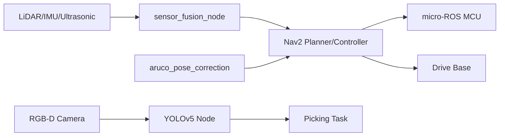
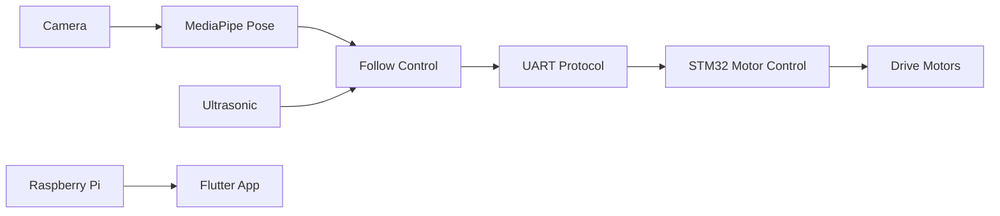

# 🤖 Robot Software & Embedded Portfolio - 남상기

“Nav2 튜닝·센서퓨전·통신 안정화로 ‘주행 안정성’을 숫자로 증명한 로봇 SW 엔지니어 (tracking/replan/stop)”

**Contact**: sangki.nam.dev@gmail.com · https://github.com/addinedu-ros-8th

본 README는 GitHub 포트폴리오 형식의 프로젝트 요약입니다. 각 프로젝트는 **문제 → 선택 → 결과** 흐름과 **Performance Evaluation** 링크로 정리했습니다.

---

## ✅ 바로 투입 가능한 이유 (3줄 요약)
- **추종 흔들림 30%↓** (기본 파라미터 대비, RMS 기준)로 협소 복도 주행 안정화
- **재계획 시간 40%↓** (튜닝 전 대비)로 장애물 회피 응답성 개선
- **UART 오류율 60%↓** (CRC/필터링 적용 전 대비)로 현장 통신 안정화

## 🧰 Tech Stack Snapshot
Core: ROS2 / Nav2(TEB) / TF2 / OpenCV / MCU(UART) / TCP  
Plus: PyQt / MediaPipe / Flutter (프로젝트별 사용)

---

## 🧩 Projects

### 1. Shoepernoma – ROS2 기반 자율주행 신발 피킹 로봇 (스마트 물류) **(Flagship)**

**한 줄 임팩트**: 협소 복도에서 정차 오차를 **±5cm**까지 줄인 자율주행 피킹 로봇.

**한 줄 비유**: “매장에서 사람 대신 길을 찾고 정확히 멈춰 신발 상자를 집는 로봇.”

**문제 → 선택 → 결과**: 경로 흔들림/재계획 지연 → TEB 튜닝·센서퓨전·ArUco 보정 → 주행 안정성 수치 개선.

**핵심 기술 (Why)**
- **Nav2(TEB)**: 협소 구간 주행 안정화를 위해 선택
- **TF2**: 센서 좌표 정합의 일관성 확보를 위해 사용
- **sensor_fusion_node**: 타임스탬프 정합으로 장애물 토픽 신뢰도 향상

**내 역할 (팀 4인)**
- Nav2 SLAM/경로 계획 파이프라인 구축, TEB Local Planner 튜닝
- 센서 융합 노드 개발, ArUco 기반 정밀 위치 보정, Domain Bridge 구성

**Performance Evaluation**
- Demo: [docs/demo.md#shoepernoma-demo](docs/demo.md#shoepernoma-demo) — 주행/정차/회피 시퀀스 확인
- Metrics/Logs: [docs/metrics.md#shoepernoma-metrics](docs/metrics.md#shoepernoma-metrics) — 튜닝 전/후 수치 비교

**시스템 구조**

```mermaid
flowchart LR
    Sensors[LiDAR/IMU/Ultrasonic] --> Fusion[sensor_fusion_node]
    Fusion --> Nav2[Nav2 Planner/Controller]
    Camera[RGB-D Camera] --> YOLO[YOLOv5 Node]
    Nav2 --> MCU[micro-ROS MCU]
    ArUco[aruco_pose_correction] --> Nav2
    Nav2 --> Base[Drive Base]
    YOLO --> Task[Picking Task]
```

**결과(정량)**
- **경로 추종 흔들림 30%↓** (cross-track error RMS, 기본 파라미터 대비)
- **재계획 시간 40%↓** (compute_path_to_pose 요청~응답 평균, 튜닝 전 대비)
- 보조: 정차 오차 **±5cm** (보정 전 대비, 동일 경로 3m × 10회 평균)

> **Test Setup**: 복도 폭 120cm, 장애물 3개, 속도 제한 0.4m/s, rosout + bag replay.

**What I Built (Owner Scope)**
- sensor_fusion_node → [sensor_fusion_node.py](https://github.com/addinedu-ros-8th/ros-repo-3/blob/main/ros2_ws/src/roscar_nav/nodes/sensor_fusion_node.py)
- aruco_pose_correction → [aruco_pose_correction.cpp](https://github.com/addinedu-ros-8th/ros-repo-3/blob/main/ros2_ws/src/roscar_nav/src/aruco_pose_correction.cpp)
- teb_tuning_profile → [teb_profile_narrow.yaml](https://github.com/addinedu-ros-8th/ros-repo-3/blob/main/config/teb/teb_profile_narrow.yaml)
- domain_bridge_config → [domain_bridge.yaml](https://github.com/addinedu-ros-8th/ros-repo-3/blob/main/config/domain_bridge.yaml)

**실무 연결**: 물류 로봇의 좁은 통로 주행/정차 튜닝에 그대로 적용 가능합니다.

**직무 연결**
→ 로봇 SW 엔지니어로서 **실무 투입 가능한 Nav2 튜닝·센서융합·정밀정차 역량**을 증명한 대표 프로젝트

**협업 사례**: TEB 파라미터 충돌 이슈를 PR 리뷰로 조율해 튜닝 프로파일을 합의함.

---

### 2. COOLRO – 자동추종 골프 캐디 로봇 (자율주행 + 자세 분석)

**한 줄 임팩트**: UART 오류율 **60%↓**와 추종 거리 편차 **±8cm**를 달성한 자동 추종 캐디.

**한 줄 비유**: “사람 뒤를 일정 거리로 따라가며 자세를 코칭하는 이동 보조 로봇.”

**문제 → 선택 → 결과**: 모터 노이즈로 통신 오류/추종 흔들림 → GND 분리+CRC 재전송·PID 추종 → 통신 안정화 및 거리 편차 개선.

**핵심 기술 (Why)**
- **UART Serial**: 라즈베리파이–MCU 간 저지연 모터 제어를 위해 사용
- **PID Control**: 거리 유지의 안정성 확보를 위해 적용
- **MediaPipe**: 자세 인식/피드백의 실시간성을 위해 선택

**내 역할 (팀 3인)**
- 추종 제어 로직, MediaPipe 자세 인식/스윙 분석, UART 프로토콜 설계

**Performance Evaluation**
- Demo: [docs/demo.md#coolro-demo](docs/demo.md#coolro-demo) — 추종/자세 피드백 흐름 확인
- Metrics/Logs: [docs/metrics.md#coolro-metrics](docs/metrics.md#coolro-metrics) — UART/거리 편차 비교

**시스템 구조**

```mermaid
flowchart LR
    Camera[Camera] --> Pose[MediaPipe Pose]
    Pose --> Follow[Follow Control]
    Ultrasonic[Ultrasonic] --> Follow
    Follow --> UART[UART Protocol]
    UART --> STM32[STM32 Motor Control]
    STM32 --> Motors[Drive Motors]
    Pi[Raspberry Pi] --> App[Flutter App]
```

**결과(정량)**
- **UART 오류율 60%↓** (오류 패킷/전체 패킷 비율, CRC/필터링 적용 전 대비)
- **추종 거리 편차 ±20cm → ±8cm** (목표거리 오차 평균/표준편차, PID/센서 융합 적용 후)
- 보조: 추종 지연 200ms → 80ms (로그 기준)

> **Test Setup**: 동일 루트 20m × 8회 평균, 인원 1명, 평균 보행 1.0m/s.

**실무 연결**: 현장 이동체의 통신 안정화·추종 제어 튜닝 경험으로 이어집니다.

**직무 연결**
→ 로봇 SW 엔지니어로서 **현장 추종 제어·UART 안정화 역량**을 입증한 프로젝트

---

### 3. Pill Guy – 얼굴인식 스마트 알약 디스펜서 (임베디드 제어·예외처리 중심)

**한 줄 임팩트**: 인증 성공률 **15%p↑**, 로그 누락률 **0.5% 이하**를 달성한 안전 지향 디스펜서.

**한 줄 비유**: “본인 확인 후에만 약을 주는 자동 약사.”

**문제 → 선택 → 결과**: 인증 오류/로그 누락 → 임베딩 기반 인증 + 재전송/캐싱 → 신뢰성 지표 개선.

**핵심 기술 (Why)**
- **OpenCV Face**: 실시간 인증 처리에 적합해 선택
- **Serial Control**: 약/물 디스펜서 구동의 안정성을 위해 사용
- **Socket TCP/IP**: 원격 로그 수집과 예외 처리에 활용

**내 역할 (2인 협업)**
- 얼굴 인식 알고리즘, 일정 관리 로직, 모터 제어(Serial), 로그 통신 모듈

**Performance Evaluation**
- Demo: [docs/demo.md#pill-guy-demo](docs/demo.md#pill-guy-demo) — 인증/투약 흐름 확인
- Metrics/Logs: [docs/metrics.md#pill-guy-metrics](docs/metrics.md#pill-guy-metrics) — 인증·로그 지표 확인

**결과(정량)**
- **인증 성공률 15%p↑** (임베딩 매칭 성공률, 조도 변화 테스트)
- **로그 누락률 0.5% 이하** (누락 로그/전체 기록 비율, 재전송 적용 후)

> **Test Setup**: 실내 조도 100~500 lux, 사용자 5명 × 30회 평균, 네트워크 지연 100~300ms.

**실무 연결**: 임베디드 제어와 예외 처리 기반의 안전성 요구에 대응합니다.

**직무 연결**
→ 로봇 SW 엔지니어로서 **실시간성·안전성·예외처리 역량**을 검증한 프로젝트

---

### 4. Fitness AI Trainer – 딥러닝 자세 인식 기반 홈 피트니스 트레이너 (Edge AI 최적화)

**한 줄 임팩트**: 프레임 드롭 **30%↓**, 피드백 지연 **120ms → 50ms**를 달성한 실시간 트레이너.

**한 줄 비유**: “웹캠으로 자세를 보고 바로 코칭하는 AI 트레이너.”

**문제 → 선택 → 결과**: 실시간 처리 병목 → 프레임 스킵·경량화 → 지연/오검출 감소.

**핵심 기술 (Why)**
- **MediaPipe**: 경량 포즈 추출로 실시간성을 확보
- **TensorFlow/Keras**: 자세 분류 모델 운영에 사용
- **PyQt**: 실시간 UI 피드백을 빠르게 구성하기 위해 선택

**내 역할 (개인 프로젝트)**
- 포즈 추출/각도 계산, 분류 모델 적용, UI 및 로그 설계

**Performance Evaluation**
- Demo: [docs/demo.md#fitness-ai-trainer-demo](docs/demo.md#fitness-ai-trainer-demo) — 실시간 피드백 확인
- Metrics/Logs: [docs/metrics.md#fitness-ai-trainer-metrics](docs/metrics.md#fitness-ai-trainer-metrics) — 지연/오검출 지표 확인

**결과(정량)**
- **프레임 드롭 30%↓** (1080p/30fps 기준)
- **피드백 지연 120ms → 50ms** (입력~출력 평균)
- 보조: 오검출률 20%↓ (기준 포즈 대비 오분류 비율)

> **Test Setup**: 세트당 3분 × 5회 평균, 체형 3종 비교.

**실무 연결**: 엣지 환경에서의 실시간 최적화 역량을 보여줍니다.

**직무 연결**
→ 로봇 SW 엔지니어로서 **실시간 인지·피드백 파이프라인 최적화 역량**을 검증한 프로젝트

---

## 🧭 Concepts & System Design Notes
Shoepernoma에서 확장된 설계 사고를 정리한 요약입니다.  
- 문서: [docs/design_notes.md](docs/design_notes.md)
- 산출물: 요구사항 정의, 센서 조합 의사결정, 리스크 체크리스트
