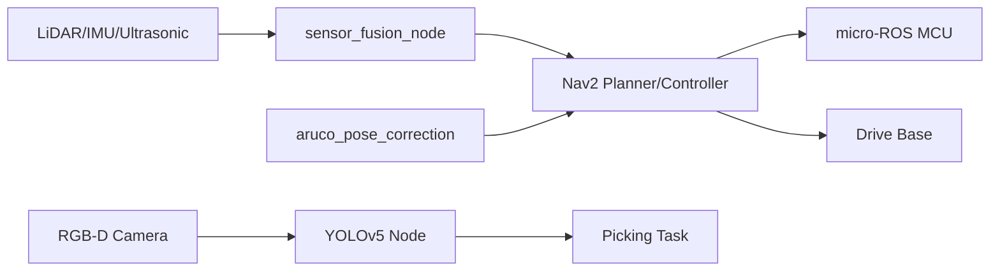
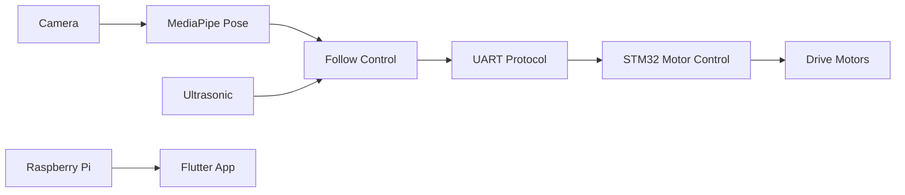

# 🤖 Robot Software & Embedded Portfolio - 남상기

“Nav2 튜닝·센서퓨전·통신 안정화로 ‘주행 안정성’을 숫자로 증명한 로봇 SW 엔지니어 (tracking/replan/stop)”

**Contact**: hinoonyaso@gmail.com · https://github.com/hinoonyaso

본 README는 GitHub 포트폴리오 형식의 프로젝트 요약입니다. 각 프로젝트는 **문제 → 선택 → 결과** 흐름과 **Performance Evaluation** 링크로 정리했습니다.

**Target Role**: ROS2/Nav2 기반 AMR·물류로봇 SW (주행 안정화/센서 정합/통신)

---

## ✅ 바로 투입 가능한 이유 (3줄 요약)
- **추종 흔들림 30%↓** (기본 파라미터 대비, RMS 기준)로 협소 복도 주행 안정화 (협소복도)
- **재계획 시간 40%↓** (튜닝 전 대비)로 장애물 회피 응답성 개선 (회피응답)
- **UART 오류율 60%↓** (CRC/필터링 적용 전 대비)로 현장 통신 안정화 (통신현장)

## 🧰 Tech Stack Snapshot
Core: ROS2 / Nav2(TEB) / TF2 / OpenCV / MCU(UART) / TCP
Environment: Ubuntu 22.04 / ROS2 Humble / Gazebo

---

## 🧩 Projects

### 1. Shoepernoma – ROS2 기반 자율주행 신발 피킹 로봇 (스마트 물류) **(Flagship)**

**한 줄 임팩트**: 협소 복도 정차 오차를 **±5cm**까지 줄인 자율주행 피킹 로봇.

**문제 → 선택 → 결과**
- 문제: 협소 복도에서 CTE RMS 증가와 stop 오버슈트 발생
- 선택: TEB cost 재조정 + narrow profile 분리/스위칭, TF/타임스탬프 정합 강화
- 결과: CTE RMS 30%↓, replan latency 40%↓, 정차 오차 ±5cm

**Design Decision Note**
- DWA/A* 기반 접근은 협소 복도에서 진동이 커 실사용에 부적합했고,
- 엔코더 부재 환경에서 TEB + profile switching이 가장 재현성 높은 결과를 보였음.

**핵심 기술 (Why)**
- **Nav2(TEB)**: 제약 120cm 복도/0.4m/s → 결정: TEB weight 재조정
- **TF2**: 제약 TF 드리프트 → 결정: 프레임 정합 유지로 흔들림 억제
- **sensor_fusion_node**: 제약 타임스탬프 불일치 → 결정: 정합 후 토픽 발행

**내 역할 (팀 4인)**
- Nav2 SLAM/경로 계획 파이프라인 구축, TEB Local Planner 튜닝
- 센서 융합 노드 개발, ArUco 기반 정밀 위치 보정, Domain Bridge 구성

**Control Concept**
- 주행 상태를 STANDBY / DRIVING / PRECISION STOP으로 분리해
  정밀 정차 구간에서 제어 파라미터를 명시적으로 전환.

**Performance Evaluation**
- Demo: [docs/demo.md#shoepernoma-demo](docs/demo.md#shoepernoma-demo) — 주행/정차/회피 시퀀스 확인
- Metrics/Logs: [docs/metrics.md#shoepernoma-metrics](docs/metrics.md#shoepernoma-metrics) — CTE RMS·replan latency 표, 재현 절차 포함

**시스템 구조**

```mermaid
flowchart LR
    Sensors[LiDAR/IMU/Ultrasonic] --> Fusion[sensor_fusion_node]
    Fusion --> Nav2[Nav2 Planner/Controller]
    Camera[RGB-D Camera] --> YOLO[YOLOv5 Node]
    Nav2 --> MCU[micro-ROS MCU]
    ArUco[aruco_pose_correction] --> Nav2
    Nav2 --> Base[Drive Base]
    YOLO --> Task[Picking Task]
```

**결과(정량)**
- **경로 추종 흔들림 30%↓** (CTE RMS, 기본 파라미터 대비 · 원인: TF 정합 안정화)
- **재계획 시간 40%↓** (replan latency, 튜닝 전 대비 · 원인: profile 스위칭)
- 보조: 정차 오차 **±5cm** (보정 전 대비, 동일 경로 3m × 10회 평균)

> **Test Setup**: 복도 폭 120cm, 장애물 3개, 속도 제한 0.4m/s, rosout + bag replay.

**운영 관점**
- Fail-safe stop: 장애물 급접근 시 즉시 정지
- 로그 레벨 분리: 주행/센서/통신 이벤트 구분 기록
- 파라미터 롤백: 기본/협소 profile 즉시 복구 플로우

**What I Built (Owner Scope)**
- **[Code: sensor_fusion_node.py](https://github.com/addinedu-ros-8th/ros-repo-3/blob/main/ros2_ws/src/roscar_nav/nodes/sensor_fusion_node.py)**
- **[Code: aruco_pose_correction.cpp](https://github.com/addinedu-ros-8th/ros-repo-3/blob/main/ros2_ws/src/roscar_nav/src/aruco_pose_correction.cpp)**
- **[Config: teb_profile_narrow.yaml](https://github.com/addinedu-ros-8th/ros-repo-3/blob/main/config/teb/teb_profile_narrow.yaml)**
- **[Config: domain_bridge.yaml](https://github.com/addinedu-ros-8th/ros-repo-3/blob/main/config/domain_bridge.yaml)**

**실무 연결**: 랙 구간(120cm)에서 profile 스위칭과 TF 정합으로 stop jitter를 줄이고 replan 응답성을 올리는 방식으로 적용.

**직무 연결**
→ 로봇 SW 엔지니어로서 **실무 투입 가능한 Nav2 튜닝·센서융합·정밀정차 역량**을 증명한 대표 프로젝트

**협업 사례**
- S: TEB 파라미터 충돌로 주행 품질 편차 발생
- A: 로그 기반 비교로 profile 분리 기준을 팀 표준으로 정립
- R: 케이스별 profile 분리 후 튜닝 논쟁이 실험 로그 기준으로 표준화됨

https://github.com/addinedu-ros-8th/ros-repo-3.git
---

### 2. COOLRO – 자동추종 골프 캐디 로봇 (자율주행 + 자세 분석)

**한 줄 임팩트**: UART 오류율 **60%↓**, 추종 거리 편차 **±8cm** 달성.

**문제 → 선택 → 결과**
- 문제: 모터 노이즈로 UART 오류 및 추종 흔들림
- 선택: GND 분리+CRC 재전송, PID 추종 제어
- 결과: 오류율 60%↓, 거리 편차 ±8cm

**핵심 기술 (Why)**
- **UART Serial**: 저지연 제어가 필요해 채택
- **PID Control**: 거리 유지 안정화 목적
- **MediaPipe**: 실시간 자세 피드백 요구

**내 역할 (팀 3인)**
- 추종 제어 로직, MediaPipe 자세 인식/스윙 분석, UART 프로토콜 설계

**Field Issue Handling**
- 모터 노이즈 환경에서 UART 오류가 발생해
  CRC + retry + safe-stop 정책으로 제어 신뢰도를 확보.

**Performance Evaluation**
- Demo: [docs/demo.md#coolro-demo](docs/demo.md#coolro-demo) — 추종/자세 피드백 흐름 확인
- Metrics/Logs: [docs/metrics.md#coolro-metrics](docs/metrics.md#coolro-metrics) — UART 오류율·거리 편차 표, 프로토콜 스펙 포함

**시스템 구조**

```mermaid
flowchart LR
    Camera[Camera] --> Pose[MediaPipe Pose]
    Pose --> Follow[Follow Control]
    Ultrasonic[Ultrasonic] --> Follow
    Follow --> UART[UART Protocol]
    UART --> STM32[STM32 Motor Control]
    STM32 --> Motors[Drive Motors]
    Pi[Raspberry Pi] --> App[Flutter App]
```

**결과(정량)**
- **UART 오류율 60%↓** (오류 패킷/전체 패킷 비율, CRC/필터링 적용 전 대비 · 원인: 재전송 적용)
- **추종 거리 편차 ±20cm → ±8cm** (목표거리 오차 평균/표준편차, PID/센서 융합 적용 후 · 원인: 제어 루프 안정화)
- 보조: 추종 지연 200ms → 80ms (로그 기준)

> **Test Setup**: 동일 루트 20m × 8회 평균, 인원 1명, 평균 보행 1.0m/s.

**실무 연결**: 노이즈 환경에서 timeout/retry 정책과 safe-stop로 제어 신뢰도를 유지한 경험을 보유.

**직무 연결**
→ 로봇 SW 엔지니어로서 **현장 추종 제어·UART 안정화 역량**을 입증한 프로젝트

---

### 3. Pill Guy – 얼굴인식 스마트 알약 디스펜서 (임베디드 제어·예외처리 중심)

**한 줄 임팩트**: 인증 성공률 **15%p↑**, 로그 누락률 **0.5% 이하** 달성.

**문제 → 선택 → 결과**
- 문제: 인증 오류 및 로그 누락 발생
- 선택: 임베딩 기반 인증 + 재전송/캐싱
- 결과: 인증 성공률 15%p↑, 로그 누락률 0.5% 이하

**핵심 기술 (Why)**
- **OpenCV Face**: 엣지 환경 인증 지연 최소화
- **Serial Control**: 액추에이터 제어 안정성 확보
- **Socket TCP/IP**: 원격 로그 수집/예외 처리 통합

**내 역할 (2인 협업)**
- 얼굴 인식 알고리즘, 일정 관리 로직, 모터 제어(Serial), 로그 통신 모듈

**Requirement-driven Design**
- 인증 실패, 네트워크 단절, 로그 누락을 핵심 리스크로 정의하고
  로컬 캐시 및 재전송 구조로 설계.

**Performance Evaluation**
- Demo: [docs/demo.md#pill-guy-demo](docs/demo.md#pill-guy-demo) — 인증/투약 흐름 확인
- Metrics/Logs: [docs/metrics.md#pill-guy-metrics](docs/metrics.md#pill-guy-metrics) — 인증·로그 지표 표, 재전송 정책 포함

**결과(정량)**
- **인증 성공률 15%p↑** (임베딩 매칭 성공률, 조도 변화 테스트)
- **로그 누락률 0.5% 이하** (누락 로그/전체 기록 비율, 재전송 적용 후)

> **Test Setup**: 실내 조도 100~500 lux, 사용자 5명 × 30회 평균, 네트워크 지연 100~300ms.

**실무 연결**: 네트워크 단절 시 로컬 캐시→재전송으로 이벤트 유실을 방지하는 패턴을 구현.

**직무 연결**
→ 로봇 SW 엔지니어로서 **실시간성·안전성·예외처리 역량**을 검증한 프로젝트

https://github.com/addinedu-ros-8th/iot-repo-1.git
---

### 4. Fitness AI Trainer – 딥러닝 자세 인식 기반 홈 피트니스 트레이너 (Edge AI 최적화)

**한 줄 임팩트**: 프레임 드롭 **30%↓**, 피드백 지연 **120ms → 50ms** 달성.

**문제 → 선택 → 결과**
- 문제: 실시간 처리 병목과 프레임 드롭
- 선택: 프레임 스킵·연산 경량화
- 결과: 지연 120ms → 50ms, 오검출률 20%↓

**핵심 기술 (Why)**
- **MediaPipe**: 경량 포즈 추출로 지연 최소화
- **TensorFlow/Keras**: 분류 모델 운영 표준화
- **PyQt**: 즉시 피드백 UI 구성

**내 역할 (개인 프로젝트)**
- 포즈 추출/각도 계산, 분류 모델 적용, UI 및 로그 설계

**Model Insight**
- 짧은 시퀀스에서는 동작 경계 오검출이 잦았고,
- 시퀀스 길이를 늘리자 관절 이동 패턴이 안정적으로 반영됨.

**Limitation**
- 데이터 불균형으로 일부 동작에서 재현성 한계가 있었으며,
  추후 데이터 증강/클래스 리밸런싱을 고려.

**Performance Evaluation**
- Demo: [docs/demo.md#fitness-ai-trainer-demo](docs/demo.md#fitness-ai-trainer-demo) — 실시간 피드백 확인
- Metrics/Logs: [docs/metrics.md#fitness-ai-trainer-metrics](docs/metrics.md#fitness-ai-trainer-metrics) — 지연/오검출 표, 프로파일 요약 포함

**결과(정량)**
- **프레임 드롭 30%↓** (1080p/30fps 기준)
- **피드백 지연 120ms → 50ms** (입력~출력 평균)
- 보조: 오검출률 20%↓ (기준 포즈 대비 오분류 비율)

> **Test Setup**: 세트당 3분 × 5회 평균, 체형 3종 비교.

**실무 연결**: Edge AI 파이프라인에서 병목 제거와 지연 수치화를 적용.
**병목 → 해결**
- Bottleneck: Pose 추출 후 각도 계산 구간이 CPU 점유
- Change: N프레임마다 계산 + threshold cache
- Effect: latency 120→50ms, drop 30%↓

**직무 연결**
→ 로봇 SW 엔지니어로서 **실시간 인지·피드백 파이프라인 최적화 역량**을 검증한 프로젝트

https://github.com/addinedu-ros-8th/deeplearning-repo-1.git
---

## 🧭 Concepts & System Design Notes
Shoepernoma에서 확장된 설계 사고를 정리한 요약입니다.  
- 문서: [docs/design_notes.md](docs/design_notes.md)
- 산출물: 요구사항 정의, 센서 조합 의사결정, 리스크 체크리스트
